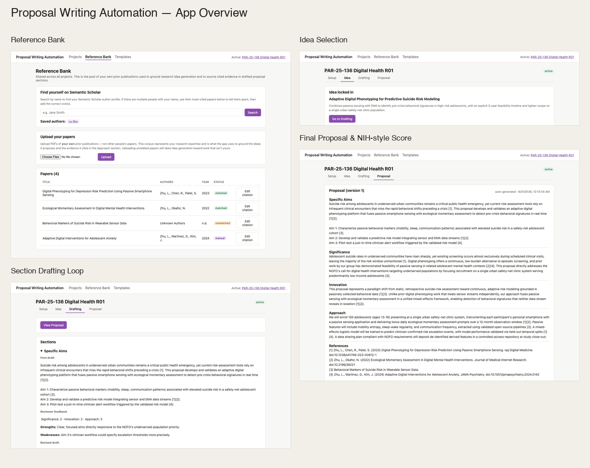

# Proposal Writing Automation System

A Vue.js + FastAPI app that automates NIH-style proposal drafting: build a reference
bank of your own papers, ingest a NOFO, generate and refine a research idea, draft
each proposal section through an LLM draft/review/revise loop, and iterate on the
combined proposal with your own feedback.



Ported from `GenAIpractice.ipynb`, restructured around a shared **Library**
(reference bank + templates) and a single active **Project** per proposal, with
explicit checkpoints for idea selection and proposal revision instead of one
fully-automated run.

## Setup

### Backend

```bash
cd backend
python3 -m venv .venv && source .venv/bin/activate
pip install -r requirements.txt
cp .env.example .env   # then fill in OPENAI_API_KEY and MISTRAL_API_KEY
uvicorn app.main:app --reload --port 8000
```

### Frontend

```bash
cd frontend
npm install
npm run dev
```

Open http://localhost:5173. The frontend expects the backend at
`http://localhost:8000` (see `frontend/src/api.js`).

## How it's organized

- `backend/library/` — the shared reference bank (uploaded papers, citation
  metadata, FAISS index) and the default NOFO-topics / section-outline templates.
- `backend/projects/{id}/` — one directory per proposal project: its NOFO,
  requirements, idea-selection rounds, section drafts, and proposal versions.
- Everything is plain JSON/text files on disk — no database. Fine for single-user,
  single-active-project use; not meant to scale beyond that.
- Long-running steps (paper ingestion, NOFO ingestion, section drafting) run as
  in-memory background jobs, polled via `GET /jobs/{id}`. Job state does not
  survive a backend restart, but the artifacts each job produces do.

## Notes on fidelity to the notebook

- The notebook's per-section RAG evidence never actually reached the drafting
  prompt (a passed-through `rag_chunks` list was always empty); this port fixes
  that by feeding the section's own freshly-retrieved evidence into the prompt.
- Idea generation asks the LLM for structured JSON (list of `{title, rationale,
  methods, impact}`) rather than free-text `"IDEA 1:"` blocks, so the UI can
  reliably let you pick one of the 10 by index.
- Semantic Scholar-based citation matching is scoped to whichever author(s) you
  select in the Reference Bank UI, rather than one hardcoded author ID.
